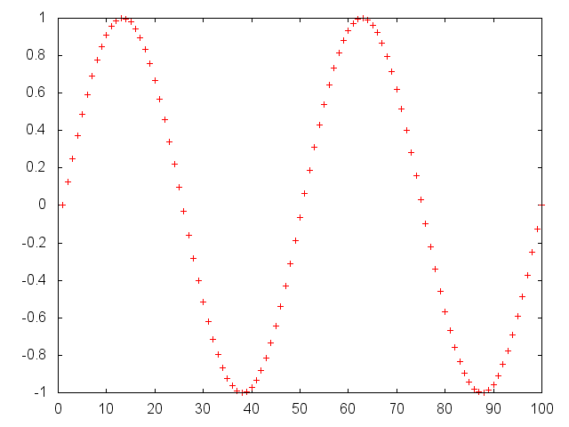
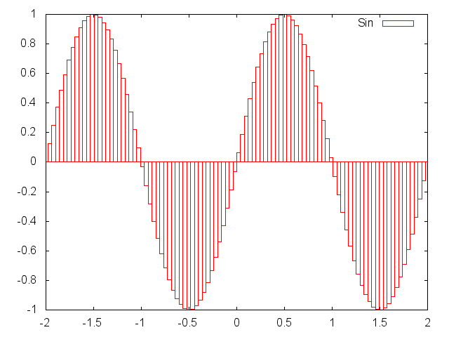
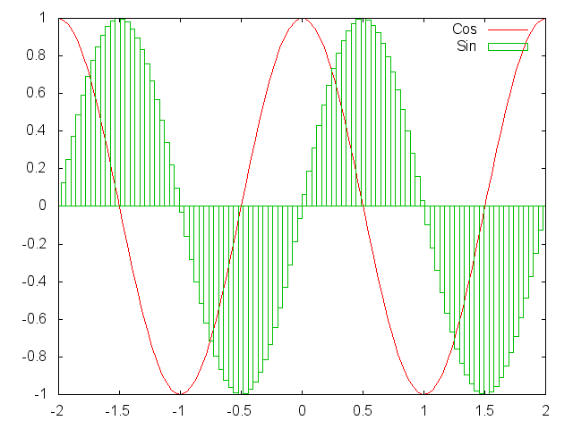
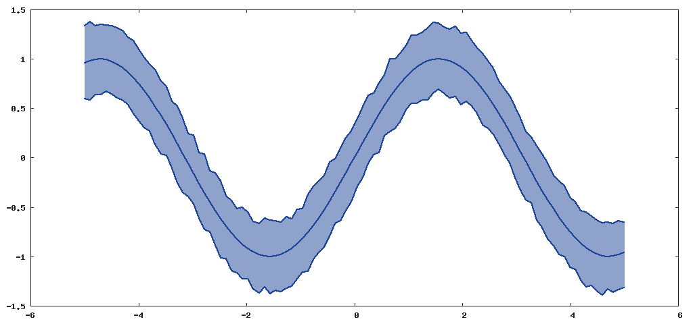
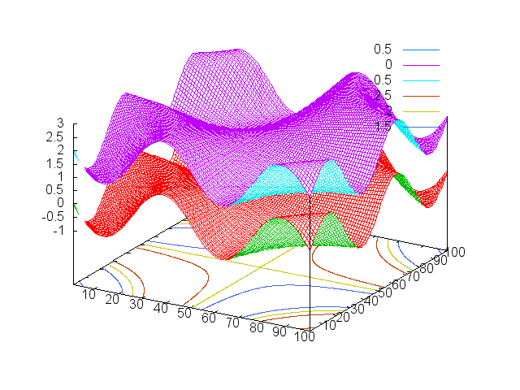

<a name="gnuplot.dok"/>
# Plotting Package Manual with Gnuplot #

A plotting package to visualize [Tensor](..:torch:index#Tensor) objects.
Functions fall into several types of categories:
  * [Line plotting](#gnuplot.line.dok)
  * [Plotting 3D surfaces](#gnuplot.surface.dok)
  * [Plotting matrices as images](#gnuplot.image.dok)
  * [Plotting histogram of data](#gnuplot.histogram.dok)
  * [Plotting directly into files](#gnuplot.files.dok)
  * [Common operations to decorate plots](#gnuplot.commons.dok)

The plotting package currently uses [gnuplot](http://gnuplot.info) as
a backend to display data. In particular, `Gnuplot` version `4.4`
or above is suggested for full support of all functionality.

By default, plot package will search for terminal in following order
  * ` windows ` terminal if operating system is windows
  * ` wxt `, ` qt `, ` x11 `  terminal if operating system is linux
  * ` aqua `, `wxt`, ` qt `, ` x11 ` terminal if operating system is mac

It is also possible to manually set any terminal type using
[gnuplot.setterm](#gnuplot.setterm). Interactivity is
dependent on the terminal being used. By default, `x11` and ''wxt
support'' different interactive operations like, zooming, panning,
rotating...

The `Gnuplot` port uses `pipes` to communicate with `gnuplot`,
therefore each plotting session is persistent and additional commands
can be sent. For advanced users [gnuplot.raw](#gnuplot.raw)
provides a free form interface to gnuplot.

<a name="gnuplot.custom.dok"/>
## Customizing Gnuplot Defaults ##

The default styles of gnuplot can be customized using a personal `.gnuplot` file
located in the users home directory. A sample file is given below as a sample. You can 
paste the contents into `$HOME/.gnuplot` file and gnuplot will use the styles 
specified in this file.

```
##### Modified version of the sample given in
##### http://www.guidolin.net/blog/files/2010/03/gnuplot


set macro

#####  Color Palette by Color Scheme Designer
#####  Palette URL: http://colorschemedesigner.com/#3K40zsOsOK-K-


   blue_000 = "#A9BDE6" # = rgb(169,189,230)
   blue_025 = "#7297E6" # = rgb(114,151,230)
   blue_050 = "#1D4599" # = rgb(29,69,153)
   blue_075 = "#2F3F60" # = rgb(47,63,96)
   blue_100 = "#031A49" # = rgb(3,26,73)

   green_000 = "#A6EBB5" # = rgb(166,235,181)
   green_025 = "#67EB84" # = rgb(103,235,132)
   green_050 = "#11AD34" # = rgb(17,173,52)
   green_075 = "#2F6C3D" # = rgb(47,108,61)
   green_100 = "#025214" # = rgb(2,82,20)

   red_000 = "#F9B7B0" # = rgb(249,183,176)
   red_025 = "#F97A6D" # = rgb(249,122,109)
   red_050 = "#E62B17" # = rgb(230,43,23)
   red_075 = "#8F463F" # = rgb(143,70,63)
   red_100 = "#6D0D03" # = rgb(109,13,3)

   brown_000 = "#F9E0B0" # = rgb(249,224,176)
   brown_025 = "#F9C96D" # = rgb(249,201,109)
   brown_050 = "#E69F17" # = rgb(230,159,23)
   brown_075 = "#8F743F" # = rgb(143,116,63)
   brown_100 = "#6D4903" # = rgb(109,73,3)

   grid_color = "#d5e0c9"
   text_color = "#222222"

   my_font = "SVBasic Manual, 12"
   my_export_sz = "1024,768"

   my_line_width = "2"
   my_axis_width = "1"
   my_ps = "1.5"
   my_font_size = "14"

# must convert font fo svg and ps
# set term svg  size @my_export_sz fname my_font fsize my_font_size enhanced dynamic rounded
# set term png  size @my_export_sz large font my_font
# set term jpeg size @my_export_sz large font my_font
# set term wxt enhanced font my_font

set style data linespoints
set style function lines
set pointsize my_ps

set style line 1  linecolor rgbcolor blue_050  linewidth @my_line_width pt 7
set style line 2  linecolor rgbcolor green_050 linewidth @my_line_width pt 5
set style line 3  linecolor rgbcolor red_050   linewidth @my_line_width pt 9
set style line 4  linecolor rgbcolor brown_050 linewidth @my_line_width pt 13
set style line 5  linecolor rgbcolor blue_025  linewidth @my_line_width pt 11
set style line 6  linecolor rgbcolor green_025 linewidth @my_line_width pt 7
set style line 7  linecolor rgbcolor red_025   linewidth @my_line_width pt 5
set style line 8  linecolor rgbcolor brown_025 linewidth @my_line_width pt 9
set style line 9  linecolor rgbcolor blue_075  linewidth @my_line_width pt 13
set style line 10 linecolor rgbcolor green_075 linewidth @my_line_width pt 11
set style line 11 linecolor rgbcolor red_075   linewidth @my_line_width pt 7
set style line 12 linecolor rgbcolor brown_075 linewidth @my_line_width pt 5
set style line 13 linecolor rgbcolor blue_100  linewidth @my_line_width pt 9
set style line 14 linecolor rgbcolor green_100 linewidth @my_line_width pt 13
set style line 15 linecolor rgbcolor red_100   linewidth @my_line_width pt 11
set style line 16 linecolor rgbcolor brown_100 linewidth @my_line_width pt 7
set style line 17 linecolor rgbcolor "#224499" linewidth @my_line_width pt 5

## plot 1,2,3,4,5,6,7,8,9
set style increment user
set style arrow 1 filled

## used for bar chart borders
set style fill solid 0.5

set size noratio
set samples 300

set border 31 lw @my_axis_width lc rgb text_color
```

<a name="gnuplot.line.dok"/>
## Line Plotting ##

Line plotting functionality covers many configurations from simplest
case of plotting a single vector to displaying multiple lines at once
with custom line specifictions.

<a name="gnuplot.plot"/>
### gnuplot.plot(x) ###
Plot vector ` x ` using dots of first default `Gnuplot` type.

```lua
x=torch.linspace(-2*math.pi,2*math.pi)
gnuplot.plot(torch.sin(x))
```


In more general form, plot vector ` y vs x ` using the format
specified. The possible entries of format string can be
  * '.' for dots
  * '+' for points
  * '-' for lines
  * '+-' for points and lines
  * '~' for using smoothed lines with cubic interpolation
  * '|' for using boxes
  * 'v' for drawing vector fiels. (In this case, x and y have to be two column vectors (x,xdelta),(y,ydelta))
  * custom string, one can also pass custom strings to use full capability of gnuplot.

```lua
x=torch.linspace(-2*math.pi,2*math.pi)
gnuplot.plot('Sin',x/math.pi,torch.sin(x),'|')
```


To plot multiple curves at a time, one can pass each plot struct in a table.

```lua
x=torch.linspace(-2*math.pi,2*math.pi)
gnuplot.plot({'Cos',x/math.pi,torch.cos(x),'~'},{'Sin',x/math.pi,torch.sin(x),'|'})
```


One can pass data with multiple columns and use custom gnuplot style strings too. When multi-column data
is used, the first column is assumed to be the `x` values and the rest of the columns are separate `y` series.

```lua
x=torch.linspace(-5,5)
y=torch.sin(x)
yp = y+0.3+torch.rand(x:size())*0.1
ym = y-(torch.rand(x:size())*0.1+0.3)
yy=torch.cat(x,ym,2)
yy=torch.cat(yy,yp,2)
gnuplot.plot({yy,' filledcurves'},{x,yp,'lines ls 1'},{x,ym,'lines ls 1'},{x,y,'lines ls 1'})
```


<a name="gnuplot.surface.dok"/>
## Plotting 3D Surfaces ##

Surface plotting creates a 3D surface plot of a given matrix `z`. Entries
of `z` are used as height values. It is also possible to specify `x` and
`y` locations corresponding to each point in `z` . If a terminal with
interactive capabilities is being used by `Gnuplot` backend (like `x11` or
`wxt` or `qt`), then rotating, zooming is also possible.

<a name="gnuplot.splot"/>
### gnuplot.splot(z) ###

Plot surface ` z ` in 3D.
```lua
x=torch.linspace(-1,1)
xx = torch.Tensor(x:size(1),x:size(1)):zero():addr(1,x,x)
xx = xx*math.pi*6
gnuplot.splot(torch.sin(xx))
```


It is also possible to specify the `x` and `y` locations of each
point in `z` by `gnuplot.splot(x,y,z)`. In this `x` and `y` has
to be the same shape as `z`.

One can also display multiple surfaces at a time.

```lua
x=torch.linspace(-1,1)
xx = torch.Tensor(x:size(1),x:size(1)):zero():addr(1,x,x)
xx = xx*math.pi*2
gnuplot.splot({torch.sin(xx)},{torch.sin(xx)+2})
```


<a name="gnuplot.image.dok"/>
## Plotting Matrices as Images ##

A given matrix can be plotted using 2D contour plot on a surface.

<a name="gnuplot.imagesc"/>
### gnuplot.imagesc(z, ['color' or 'gray']) ###

Plot surface ` z ` using contour plot. The second argument defines
the color palette for the display. By default, grayscale colors are
used, however, one can also use any color palette available in
`Gnuplot`.

```lua
x=torch.linspace(-1,1)
xx = torch.Tensor(x:size(1),x:size(1)):zero():addr(1,x,x)
xx = xx*math.pi*6
gnuplot.imagesc(torch.sin(xx),'color')
```


<a name="gnuplot.histogram.dok"/>
## Histograms ##

Given a tensor, the distribution of values can be plotted using
`gnuplot.hist` function.

<a name="gnuplot.hist"/>
### gnuplot.hist(x, [nbins, min, max]) ###

Plot the histogram of values in `N-D` tensor `x`, optionally using `nbins`
number of bins and only using values between `min` and `max`.

```lua
gnuplot.hist(torch.randn(100000),100)
```


<a name="gnuplot.files.dok"/>
## Plotting Directly into Files ##

Any of the above plotting utilities can also be used for directly plotting
into `eps` or `png` files, or `pdf` files if your gnuplot installation
allows. A final gnuplot.plotflush() command ensures that all output is
written to the file properly.

```lua
gnuplot.epsfigure('test.eps')
gnuplot.plot({'Sin Curve',torch.sin(torch.linspace(-5,5))})
gnuplot.xlabel('X')
gnuplot.ylabel('Y')
gnuplot.plotflush()
```

<a name="gnuplot.commons.dok"/>
## Common Operations ##

It is possible to manage multiple plots at a time, printing plots to
png, eps or pdf files or creating plots directly on png or eps or pdf files.

There are also several handy operations for decorating plots which are
common to many of the plotting functions.


<a name="gnuplot.setgnuplotexe"/>
### gnuplot.setgnuplotexe(exe) ###

Manually set the location of gnuplot executable.

<a name="gnuplot.setterm"/>
### gnuplot.setterm(teerm) ###

Manually set the gnuplot terminal.

<a name="gnuplot.closeall"/>
### gnuplot.closeall() ###

Close all gnuplot active connections. This will not be able to close
open windows, since on the backend gnuplot also can not close windows.

<a name="gnuplot.figure"/>
### gnuplot.figure([n]) ###

Select (or create) a new figure with id `n`. Note that until a plot
command is given, the window will not be created. When `n` is
skipped, a new figure is created with the next consecutive id.

<a name="gnuplot.epsfigure"/>
### gnuplot.epsfigure(fname) ###

Creates a figure directly on the `eps` file given with
`fname`. This uses `Gnuplot` terminal `postscript eps enhanced color`.

<a name="gnuplot.pdffigure"/>
###  gnuplot.pdffigure(fname) ###

Only available if your installation of gnuplot has been compiled
with `pdf` support enabled.

Creates a figure directly on the `pdf` file given with
`fname`. This uses `Gnuplot` terminal `pdf enhanced color`,
or `pdfcairo enhanced color` if available.

<a name="gnuplot.pngfigure"/>
### gnuplot.pngfigure(fname) ###

Creates a figure directly on the `png` file given with
`fname`. This uses `Gnuplot` terminal `png`.

<a name="gnuplot.svgfigure"/>
###  gnuplot.svgfigure(fname) ###

Creates a figure directly on the `svg` file given with `fname`. This uses
`Gnuplot` terminal `svg`.

<a name="gnuplot.plotflush"/>
### gnuplot.plotflush([n]) ###

This command sends `unset output` to underlying gnuplot. Usefull for
flushing file based terminals.

<a name="gnuplot.figprint"/>
### gnuplot.figprint(fname) ###

Prints the current figure to the given file with name `fname`. Only `png`
or `eps` files are supported by default. If your gnuplot installation
allows, `pdf` files are also supported.

<a name="gnuplot.xlabel"/>
### gnuplot.xlabel(label) ###

Sets the label of `x` axis to `label`. Only supported for gnuplot
version 4.4 and above.

<a name="gnuplot.ylabel"/>
### gnuplot.ylabel(label) ###

Sets the label of `y` axis to `label`. Only supported for gnuplot
version 4.4 and above.

<a name="gnuplot.zlabel"/>
### gnuplot.zlabel(label) ###

Sets the label of `z` axis to `label`. Only supported for gnuplot
version 4.4 and above.

<a name="gnuplot.title"/>
### gnuplot.title(title) ###

Sets the title of the plot to `title`. Only supported for gnuplot
version 4.4 and above.

<a name="gnuplot.grid"/>
### gnuplot.grid(toggle) ###

If `toggle` is `true` then a grid is displayed, else it is
hidden. Only supported for gnuplot version 4.4 and above.

<a name="gnuplot.movelegend"/>
### gnuplot.movelegend(hloc,vloc) ###

Set the location of legend key. `hloc` can be '''left', 'right' or
'center`'. `vloc` can be `'top', 'bottom' or 'middle'''. Only
supported for gnuplot version 4.4 and above.

<a name="gnuplot.axis"/>
### gnuplot.axis(axis) ###

Sets the properties of axis for the current plot.

  * `auto` : auto scales the axis to fit data and plot canvas
  * `image` : scales the axis aspect ratio so that a circle is drawn as circle.
  * `equal` : same as `image`.
  * `fill` : resets the aspect ratio of the plot to original values so that it fills up the canvas as good as possible.
  * {xmin,xmax,ymin,ymax} : Sets the limits of x and y axes. Use an empty string (2 apostophes in a row) if you want to keep the current value.

<a name="gnuplot.raw"/>
### gnuplot.raw(command) ###

This command is useful for advanced users of gnuplot. `command` is
directly passed to gnuplot without any formatting.

